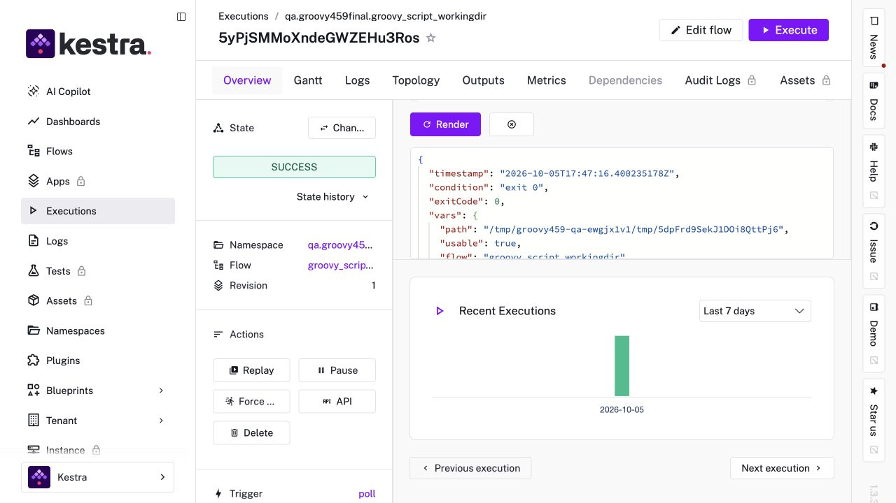
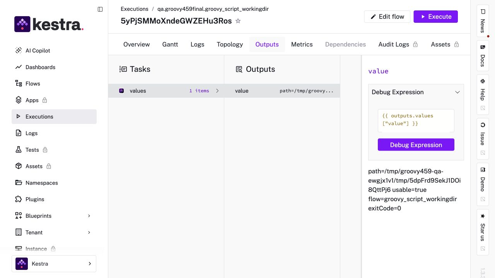
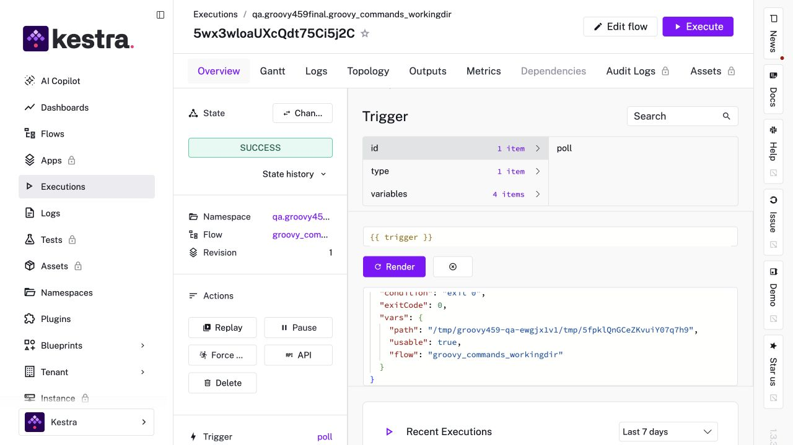
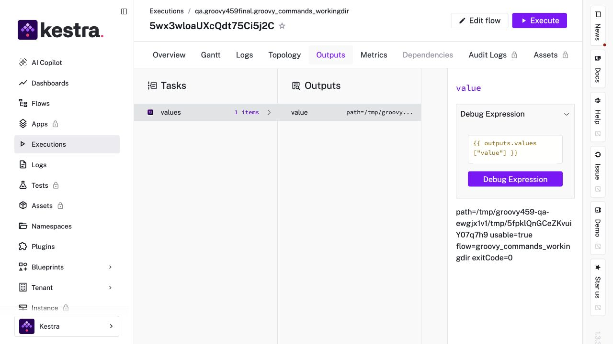

# Groovy trigger QA evidence

Fresh rendering QA for PR #459, source commit `78c3c1c00af47bfaf37e72bc36d9d73a1d7791c3`, captured on 2026-10-05.

Kestra `v1.3.39-no-plugins`, Groovy `jdk21`, one newly built Groovy plugin JAR. JAR SHA-256: `46591e32017920283f444364a73d029b0e13aadc6fe3b2343fc50b24ec66870a`.

Both included flows ran through the scheduler and Docker runner. Their Groovy programs checked that the rendered working directory is absolute and usable, wrote/read a probe file, emitted structured values, and reached successful downstream Return tasks. Both flows were disabled after QA.

- Script execution: `5yPjSMMoXndeGWZEHu3Ros`
- Commands execution: `5wx3wloaUXcQdt75Ci5j2C`

Screenshots 03–06 are fresh, unedited UI captures. Screenshots 01–02 are historical evidence from the original implementation and predate the rendering fix.

## Fresh screenshots

SHA-256: `9acfeae337e178206254fea470f2f7e530487eccc376f75df0519c7bdefde8ef`

SHA-256: `397e59090335835e147d6a8744d3512d5ef6ad08f2072f2f9c484dbf5f044de8`

SHA-256: `3e797fc74137b5113f78851bee14f174368dfd91c5335c6437e76b391798394b`

SHA-256: `ad50315dda8cff2e984a57259c72d52da9ba2ea1ca53fff3e13778de7af2cb19`

